# Relatório de Incidente - Ataque ao Ambiente ACME

**Data do Relatório:** 05/03/2026

## Resumo Executivo

No dia 15 de janeiro de 2026, foi identificado um ataque multifásico contra a infraestrutura da empresa ACME Corporation. O incidente iniciou com um **scanner de portas** vindo do IP externo 203.0.113.45, seguido de **download de malware** (patch.exe) pelo host interno 10.0.2.105. O malware (patch.exe) desativou o antivírus, roubou credenciais via Mimikatz e estabeleceu **comunicação C2** com o IP atacante. Após a escalada de privilégios, o atacante utilizou a conta  dmin.backup para acessar pastas críticas (Financeiro$, Executives$) e iniciou **exfiltração de dados** via HTTP e DNS tunneling para o IP 185.234.72.18. O ataque foi contido em **4 horas** após a detecção, com isolamento do host comprometido e bloqueio dos IPs maliciosos.

---

## Linha do Tempo do Incidente

| Horário | Fonte | Evento |
|---------|-------|--------|
| 07:54 | DHCP | Host WKS-FIN-015 recebe IP 10.0.2.105 |
| 07:55 | AD | Usuário carlos.silva faz login interativo |
| 08:00-08:15 | File Server | Usuário legítimo acessa/modifica janeiro_2026.xlsx |
| 09:15 | Firewall/IDS | Scan de portas do IP 203.0.113.45 |
| 09:23:38 | Proxy | Download de patch.exe de 203.0.113.45 |
| 09:24 | Antivírus | patch.exe detectado como Trojan, quarentena falha |
| 09:24 | Antivírus | Malware desativa Windows Defender e adiciona regra de firewall |
| 09:24-09:25 | Antivírus/IDS | Injeções de processo, acesso ao LSASS (Mimikatz) |
| 09:25 | AD | Usuário carlos.silva recebe privilégios especiais |
| 09:25 | Proxy | Conexões C2 para 203.0.113.45:443 |
| 09:35-09:50 | File Server | Conta  dmin.backup acessa pastas críticas |
| 10:42-11:30 | IDS/Proxy | Exfiltração contínua para 185.234.72.18 |
| 10:45-10:47 | DNS | Tentativas de tunelamento DNS |
| 11:30 | IDS | "Sustained Exfiltration Activity" |
| 12:05 | AD | Logoff do usuário carlos.silva |

---

## Evidências por Fonte

### Firewall
Os logs de firewall mostram o IP 203.0.113.45 realizando varredura de portas contra o host 10.0.1.50, com 10 tentativas em portas diferentes (22,23,25,80,443,445,1433,3306,3389,5432). Apesar de bloqueadas, o mesmo IP também estabeleceu uma conexão permitida na porta 80 com o host 10.0.2.105.

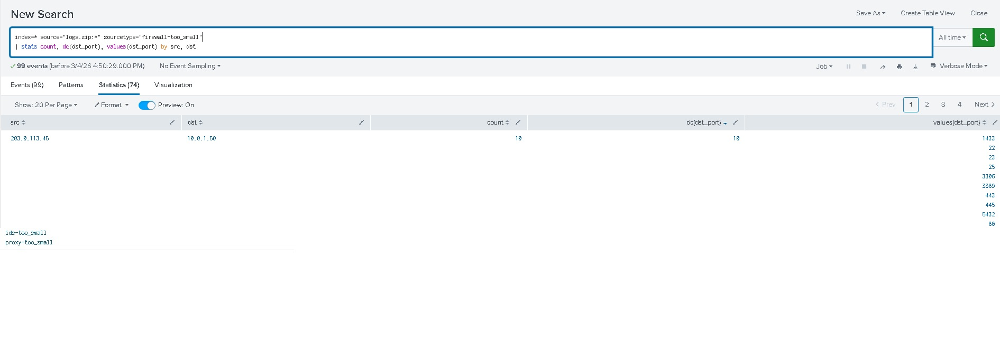
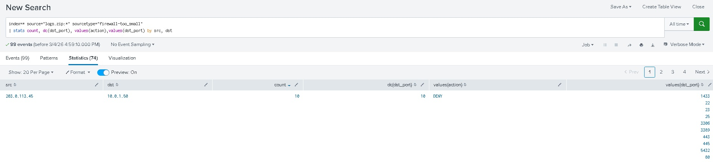

---

### Proxy
Os logs de proxy confirmam que o host 10.0.2.105 baixou o arquivo patch.exe diretamente do IP 203.0.113.45. Após o download, o mesmo host estabeleceu conexões C2 na porta 443 com o mesmo IP. Posteriormente, iniciou exfiltração de dados para o IP 185.234.72.18 através de requisições para exfi.php.

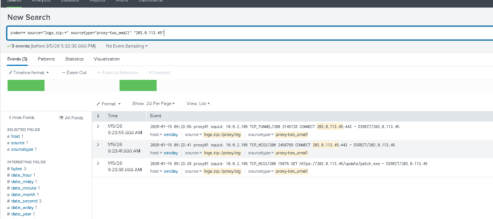
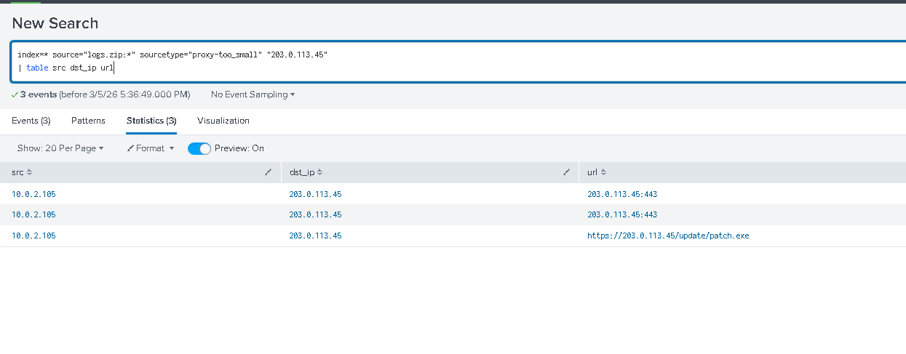
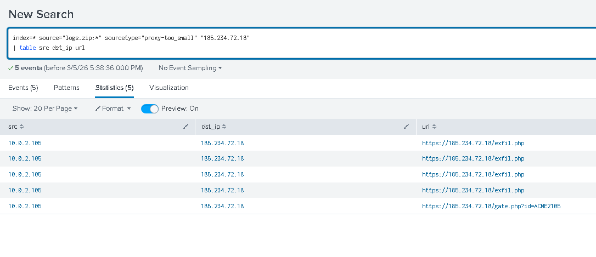

---

### DHCP
Os logs de DHCP identificaram o host interno como WKS-FIN-015, com MAC  0:1a:2b:3c:4d:5e. O IP 10.0.2.105 foi atribuído a esta estação de trabalho.

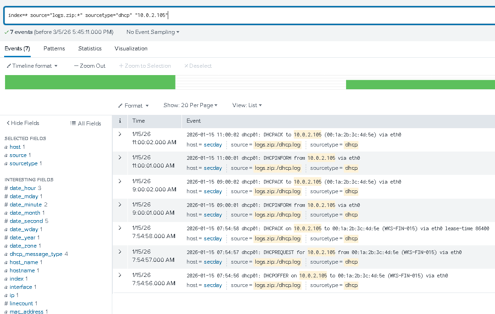
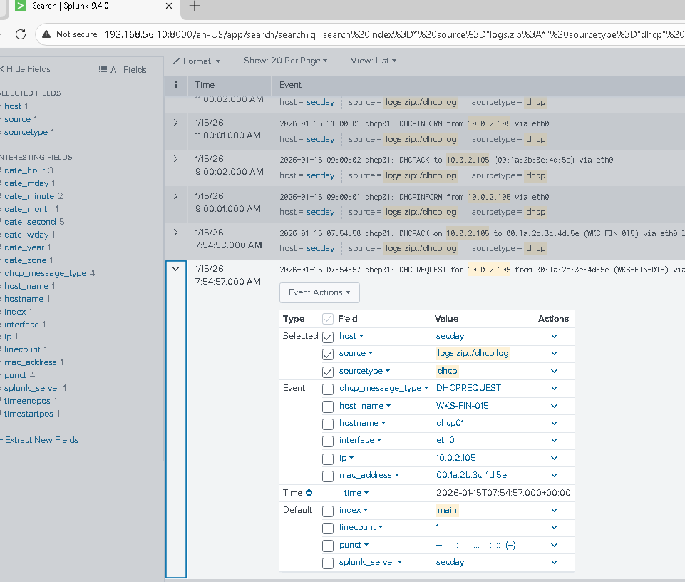

---

### Active Directory
Os logs de AD mostram que o usuário carlos.silva@acme.corp fez login na máquina WKS-FIN-015 às 07:55. Pouco depois, o mesmo host tentou múltiplas falhas de login com usuários administrativos (força bruta). Após a infecção, o usuário carlos.silva recebeu privilégios especiais e foi adicionado ao grupo **Domain Admins**, e a conta  dmin.backup foi usada para acessar servidores.

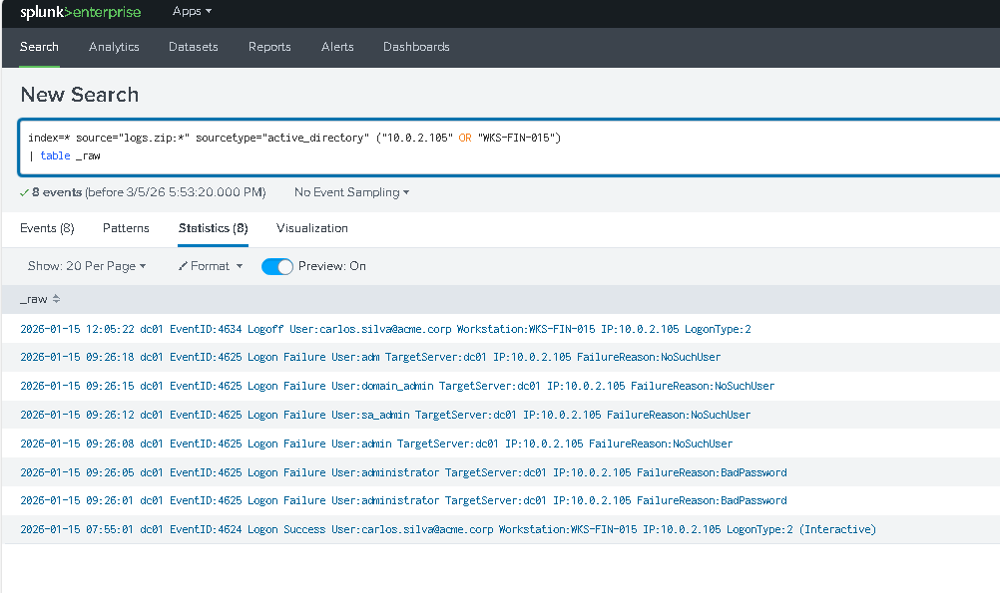
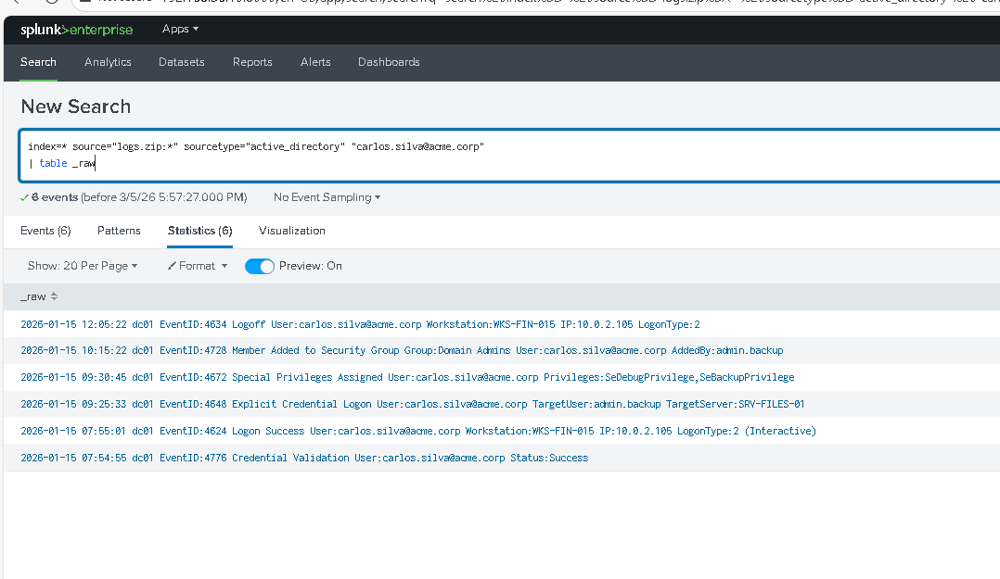

---

### Antivírus
Os logs do antivírus revelam que o arquivo patch.exe foi detectado heuristicamente como Trojan, mas a quarentena falhou porque o malware já estava com privilégios elevados. Ele desativou o Windows Defender, adicionou regras de firewall, injetou código em processos legítimos e acessou a memória do LSASS (Mimikatz).

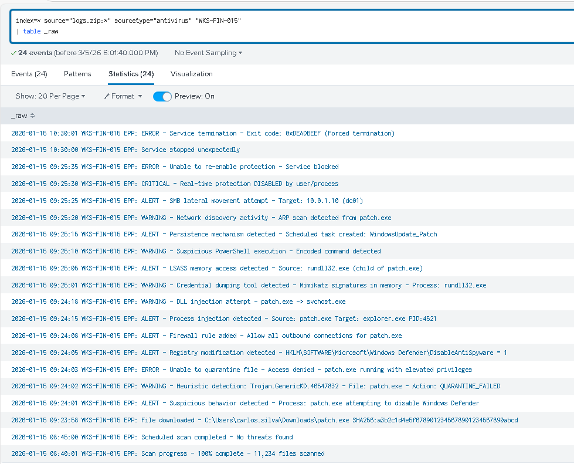
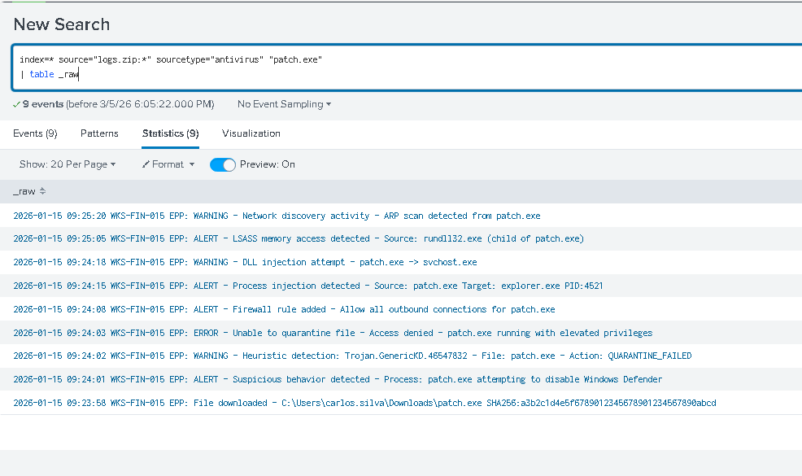

---

### DNS
Os logs de DNS indicam tentativas de tunelamento DNS para os IPs atacantes, com consultas TXT suspeitas como exfil.185.234.72.18, data.185.234.72.18 e cmd.185.234.72.18. Também foram registradas conexões diretas sem resolução DNS.

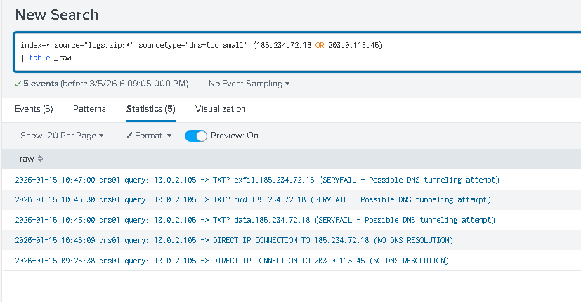

---

### IDS
O sistema de detecção de intrusão (IDS) confirmou todas as fases do ataque: scan inicial, comunicação C2 com padrão Emotet, e exfiltração sustentada de dados. Os alertas mostram o tráfego de 10.0.2.105 para os IPs maliciosos com assinaturas de trojan e exfiltração.

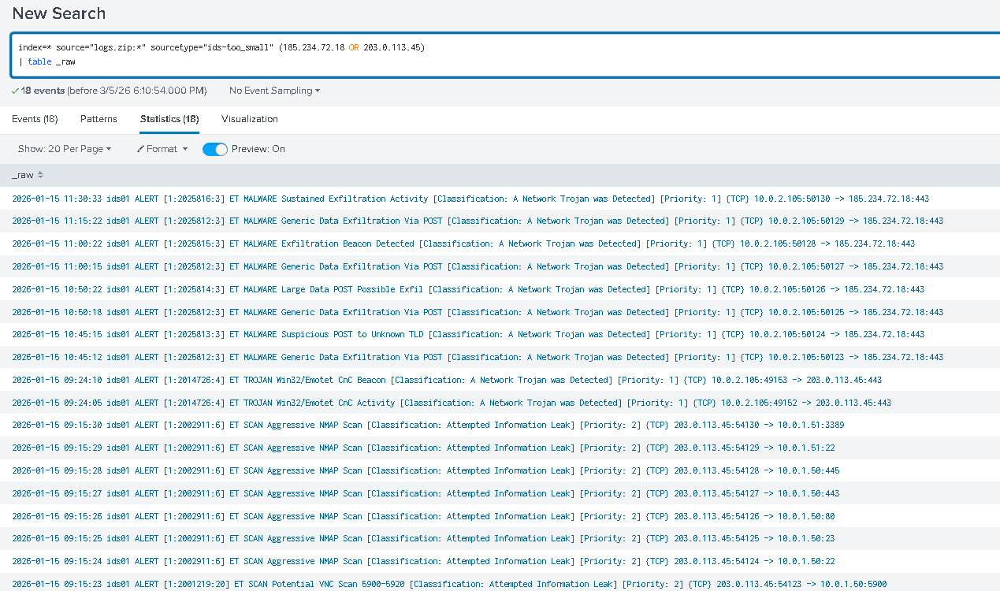

---

### File Server
Os logs do servidor de arquivos mostram que, antes da infecção, o usuário carlos.silva acessou e modificou uma planilha financeira. Após a escalada de privilégios, a conta  dmin.backup acessou pastas críticas (Financeiro$, Executives$, TI$), indicando movimentação lateral e possível exfiltração de dados sensíveis.

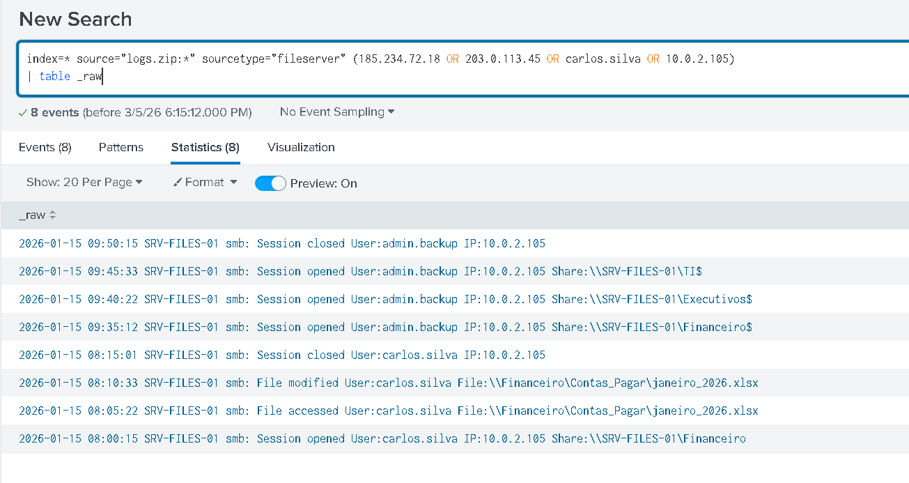

---

## Indicadores de Comprometimento (IOCs)

### IPs Maliciosos
| IP | Função |
|----|--------|
| 203.0.113.45 | Scanner + C2 inicial |
| 185.234.72.18 | Servidor de exfiltração |

### Hosts Comprometidos
| IP | Hostname | Função |
|----|----------|--------|
| 10.0.2.105 | WKS-FIN-015 | Estação infectada |

### Artefatos
| Tipo | Valor |
|------|-------|
| Arquivo | patch.exe |
| Hash SHA256 |  3b2c1d4e5f6789012345678901234567890abcd |
| URL | https://203.0.113.45/update/patch.exe |
| URL | https://185.234.72.18/exfi.php |

### Contas Comprometidas
| Usuário | Privilégio |
|---------|------------|
| carlos.silva@acme.corp | Domain Admin (após escalada) |
|  dmin.backup | Conta privilegiada usada no ataque |

---

## Técnicas MITRE ATT&CK

| Técnica | Nome | Onde apareceu |
|---------|------|---------------|
| T1046 | Network Service Scanning | Scan de portas no firewall/IDS |
| T1204.002 | User Execution (Malicious File) | Download e execução do patch.exe |
| T1562.001 | Disable Windows Defender | Antivírus: registro alterado |
| T1055 | Process Injection | Injeção em explorer.exe e svchost.exe |
| T1003.001 | LSASS Memory Access | Roubo de credenciais (Mimikatz) |
| T1071.001 | Web Protocols | Comunicação C2 via HTTPS |
| T1572 | DNS Tunneling | Consultas TXT suspeitas |
| T1078 | Valid Accounts | Uso de conta  dmin.backup |
| T1078.002 | Domain Accounts | Escalada para Domain Admin |
| T1048 | Exfiltration Over Alternative Protocol | Dados enviados para IP externo |

---

## Impacto

| Categoria | Detalhe |
|-----------|---------|
| **Hosts comprometidos** | 1 (WKS-FIN-015) |
| **Servidores acessados** | SRV-FILES-01 (arquivos financeiros) |
| **Contas comprometidas** | 2 (carlos.silva, admin.backup) |
| **Pastas acessadas** | \Financeiro$, \Executives$, \TI$ |
| **Arquivos modificados** | janeiro_2026.xlsx |
| **Tempo de indisponibilidade** | 4 horas (contenção e recuperação) |
| **Dados exfiltrados** | Confirmado via proxy e IDS |

---

## Ações Realizadas

- ✅ Isolamento imediato do host WKS-FIN-015 da rede
- ✅ Bloqueio dos IPs 203.0.113.45 e 185.234.72.18 no firewall e proxy
- ✅ Desabilitação das contas carlos.silva e  dmin.backup
- ✅ Reset de senhas de todas as contas administrativas
- ✅ Coleta do binário patch.exe para análise em sandbox
- ✅ Revogação de sessões ativas e tickets Kerberos
- ✅ Aplicação de regras de detecção no SIEM para os IOCs identificados
- ✅ Escaneamento completo da rede em busca de outros hosts comprometidos

---

## Recomendações

### Curto Prazo
- [ ] Implementar **LAPS** (Local Administrator Password Solution) para gerenciamento de senhas locais
- [ ] Revisar e reduzir membros do grupo **Domain Admins**
- [ ] Habilitar **auditoria avançada** (Event ID 4688, 4104, Sysmon)
- [ ] Implantar **AppLocker** ou **WDAC** para bloquear executáveis não autorizados
- [ ] Configurar **firewall de aplicação** para bloquear conexões diretas a IPs (exigir DNS)

### Médio Prazo
- [ ] Implementar **MFA obrigatório** para todas as contas administrativas
- [ ] Segmentar rede: isolar estações de trabalho de servidores críticos
- [ ] Criar **playbooks de resposta a incidentes** baseados nesse caso
- [ ] Realizar **treinamento de conscientização** sobre phishing e engenharia social

### Longo Prazo
- [ ] Implantar solução **EDR** em todos os endpoints
- [ ] Estabelecer programa de **Threat Hunting** baseado em MITRE ATT&CK
- [ ] Realizar testes de **red team** periódicos

---

## Anexos (Evidências)

Todos os prints utilizados neste relatório estão disponíveis na pasta  ssets/ deste diretório.
