# Prevenção – Alertas Criados Pós-Incidente

**Data:** 12/03/2026  
**Autor:** Flávio  
**Objetivo:** Criar alertas no SIEM para detectar rapidamente comportamentos observados durante o incidente investigado.

---

## 🔹 Alerta 1 – Força Bruta SSH

### Busca
`spl
index=* sourcetype=ssh "Failed password"
| stats count by src_ip, hostname, user
| where count > 10
Configuração
Título: Brute Force SSH

Descrição: Este alerta identifica quando um possível ataque SSH ocorre

Tipo: Agendado (a cada 15 minutos)

Time Range: Últimos 15 minutos

Trigger: Número de resultados > 0

Supressão: Por user por 15 minutos

Severidade: Média

Resultado do disparo
**Busca do alerta SSH:** consulta que identifica tentativas de força bruta.

Busca do alerta SSH
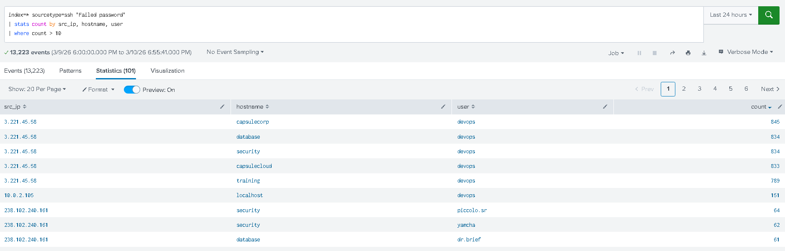

**Configuração do alerta SSH:** parâmetros e threshold definidos.

Configuração do alerta SSH
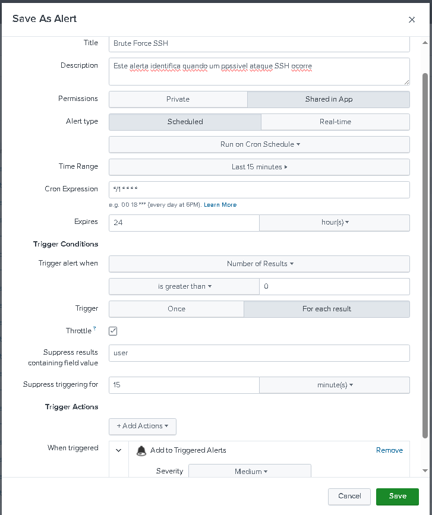

<<<<<<< HEAD
Imagem: ssh lista ativos
https://assets/ssh-lista-ativos.jpg
**Alerta SSH disparado:** momento em que o alerta foi acionado.
=======

Lista de alertas SSH ativos
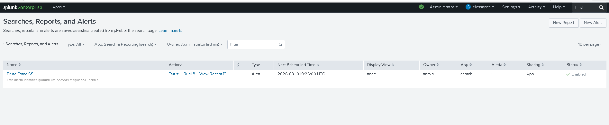

>>>>>>> a46607d486072d35933f57832b0893dd3f178f83

Alerta SSH disparado
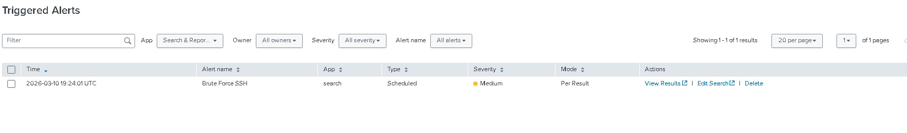

**Resultados do alerta SSH:** detalhes das tentativas detectadas.

Resultados do alerta SSH
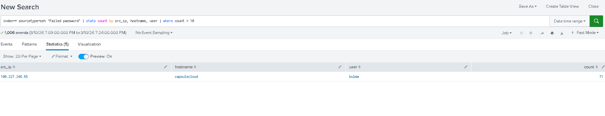

🔹 Alerta 2 – SQL Injection
Busca
spl
index=* sourcetype=apache uri IN ("*SELECT*", "*DROP*", "*1=1--*", "*wpscan*", "*UNION*")
| eval uri = urldecode(uri)
| stats count, values(http_method), values(http_refer), values(http_status), values(user_agent) by src_ip
Configuração
Título: Possível ataque WEB identificado

Descrição: Este alerta identifica um possível ataque baseado em palavras chave

Tipo: Agendado (a cada 15 minutos)

Time Range: Últimos 15 minutos

Trigger: Número de resultados > 0

Supressão: Por 15 minutos

Severidade: Alta

Resultado do disparo
**Busca do alerta SQL:** consulta que identifica possíveis injeções SQL.

Busca do alerta SQL
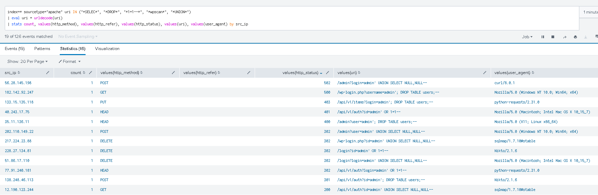

**Configuração do alerta SQL:** parâmetros e palavras-chave monitoradas.

Configuração do alerta SQL
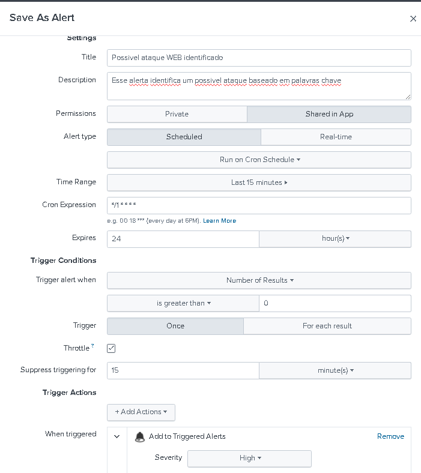

**Lista completa de alertas:** visão geral de todos os alertas configurados.

Lista completa de alertas
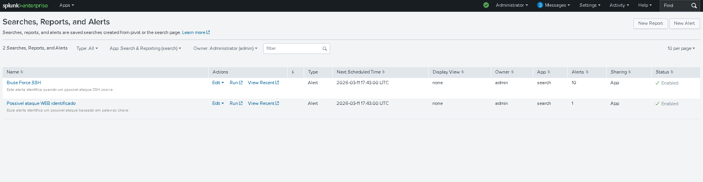

**Alerta SQL disparado:** momento em que o alerta foi acionado.

Alerta SQL disparado
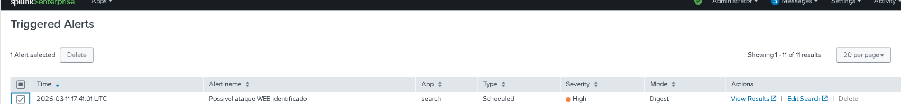

**Resultados do alerta SQL:** detalhes das tentativas de injeção.

Resultados do alerta SQL
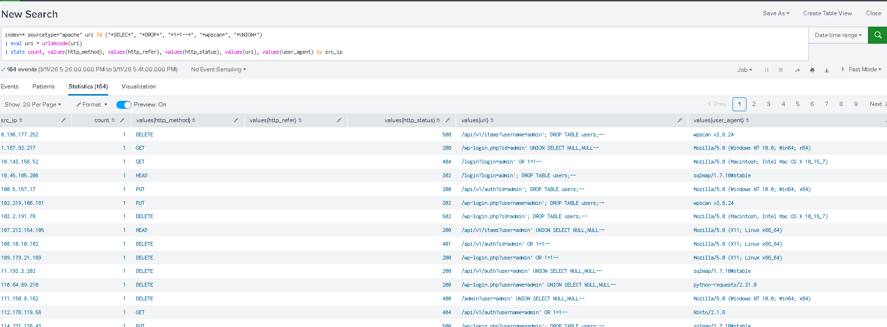

🔹 Alerta 3 – IOC: User-Agent sqlmap e Usuário devops
Busca
spl
index=* (user_agent = "sqlmap/1.7.10#stable" OR user="devops")
| stats values(user_agent) as user_agent, values(user) as user by host, sourcetype
Configuração
Título: IOC detectado incidente XPT0

Descrição: Este alerta identifica quando alguns dos IOCs relacionados ao incidente XPT0 são identificados nos logs

Tipo: Agendado (a cada 15 minutos)

Time Range: Últimos 15 minutos

Trigger: Número de resultados > 0

Supressão: Por sourceType por 15 minutos

Severidade: Crítica

Resultado do disparo
**Busca do alerta IOC:** consulta que identifica indicadores de comprometimento.

Busca do alerta IOC
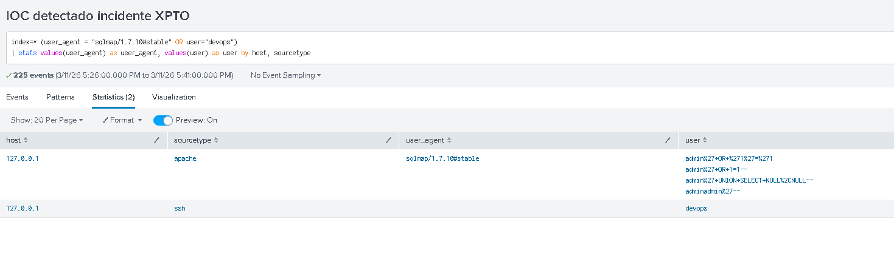

**Configuração do alerta IOC:** parâmetros para detecção de IOCs.

Configuração do alerta IOC
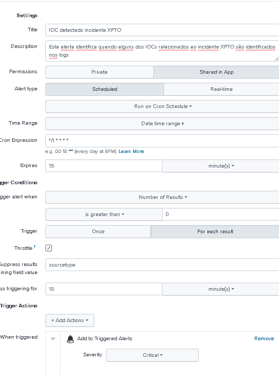

**Alerta IOC disparado:** momento em que o alerta foi acionado.

Alerta IOC disparado
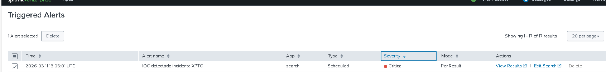

**Resultados do alerta IOC:** detalhes dos IOCs detectados.

Resultados do alerta IOC
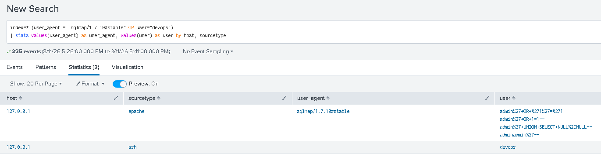

✅ Resumo dos Alertas Criados
Alerta    Descrição    Severidade
Brute Force SSH    Múltiplas falhas de login no SSH    Média
SQL Injection    Palavras-chave suspeitas em requisições web    Alta
IOC sqlmap / devops    Indicadores de comprometimento do incidente    Crítica
📂 Anexos
Todos os prints utilizados neste relatório estão disponíveis na pasta assets/ deste diretório.

