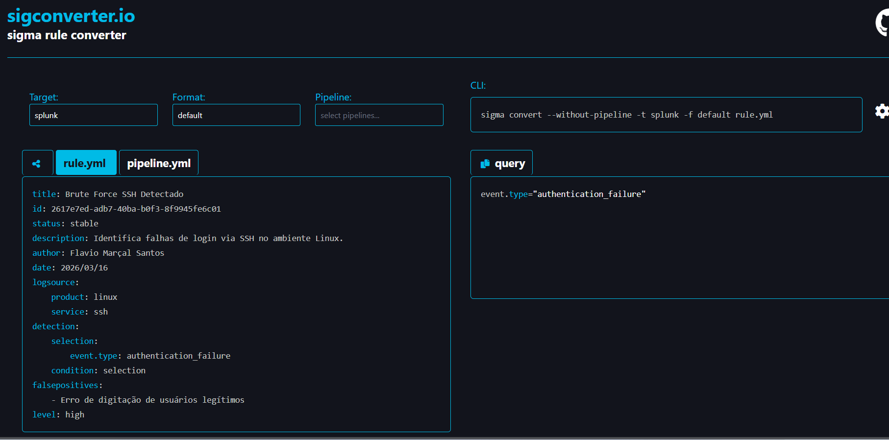
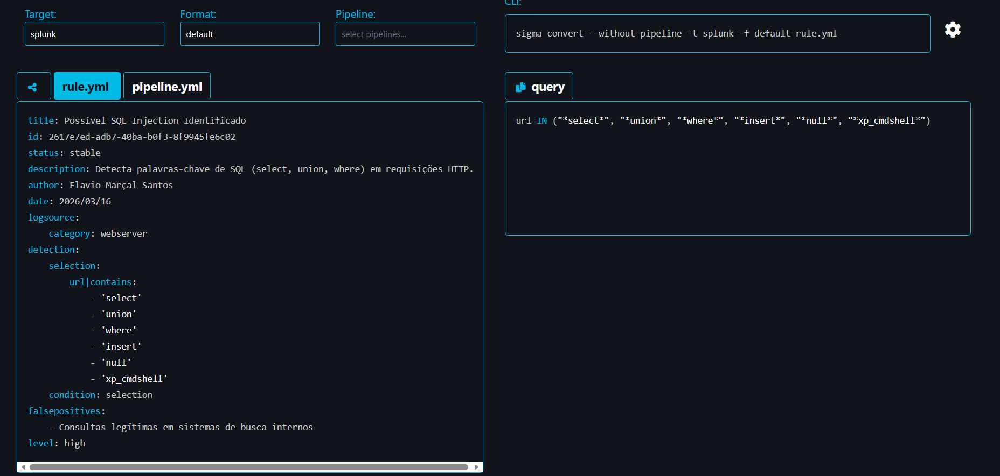
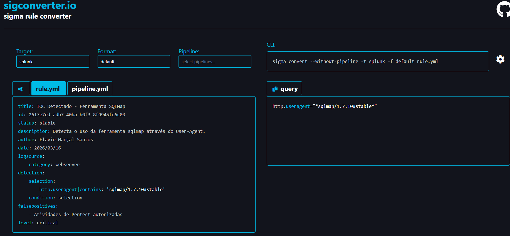
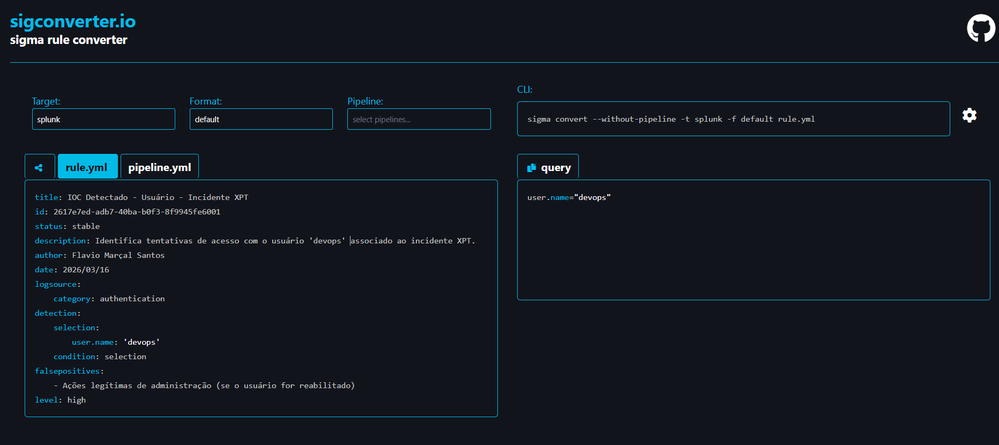
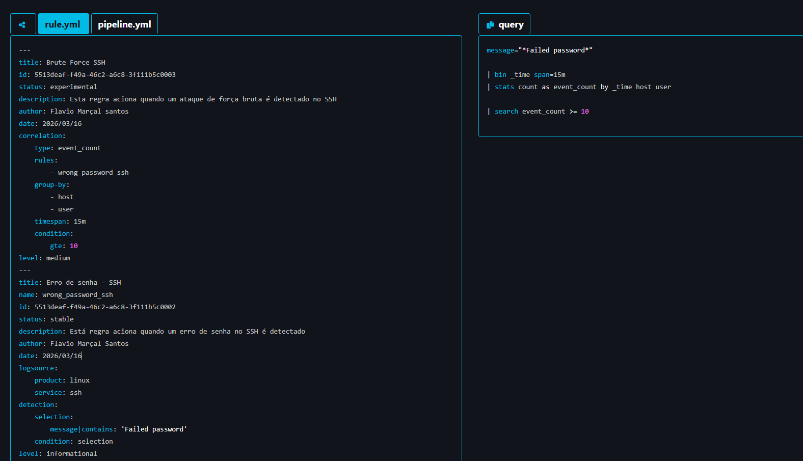

# Sigma Rules - Conversão de Regras de Detecção

**Data:** 16/03/2026  
**Autor:** Flavio Marcal Santos  
**Objetivo:** Explorar o formato Sigma para criação e conversão de regras de detecção entre diferentes SIEMs.

---

## Regras Desenvolvidas

### 1. Força Bruta SSH
**ID:** 2617e7ed-adb7-40ba-b0f3-8f9945fee601 | **Level:** high

**Conversão Splunk:** event.type="authentication_failure"

---

### 2. SQL Injection
**ID:** 2617e7ed-adb7-40ba-b0f3-8f9945fe6c02 | **Level:** high

**Conversão Splunk:** url IN ("select*", "union*", "where*", "insert*", "null*", "xp_cmdshell*")

---

### 3. IOC SQLMap
**ID:** 2617e7ed-adb7-40ba-b0f3-8f9945fe6c03 | **Level:** critical

**Conversão Splunk:** http.useragent="*sqlmap/1.7.10#stable"

---

### 4. IOC Usuário devops
**ID:** 2617e7ed-adb7-40ba-b0f3-8f9945fe6001 | **Level:** high

**Conversão Splunk:** user_name="devops"

---

### 5. Correlação SSH
**ID:** 5513deaf-f49a-46c2-a6c8-3f111b5c0003 | **Level:** medium

**Regra base:** 5513deaf-f49a-46c2-a6c8-3f111b5c0002 (Erro de senha SSH)

---

## Resumo

| Regra | ID | Level | Splunk |
|-------|-----|-------|--------|
| Força Bruta SSH | 2617e7ed...601 | high | ✅ |
| SQL Injection | 2617e7ed...c02 | high | ✅ |
| IOC SQLMap | 2617e7ed...c03 | critical | ✅ |
| IOC devops | 2617e7ed...001 | high | ✅ |
| Correlação SSH | 5513deaf...003 | medium | ✅ |

**Total: 5 regras | 5 prints**

---

## 📁 Estrutura de Arquivos
sigma-rules-conversao/
├── README.md
└── assets/
├── sigma-regra-ssh-bruta.jpg
├── sigma-regra-sql-injection.jpg
├── sigma-regra-ioc-sqlmap.jpg
├── sigma-regra-ioc-devops.jpg
└── sigma-regra-correlacao-ssh.jpg

text

## 📌 Anexos

Todos os prints estão na pasta ssets/.
