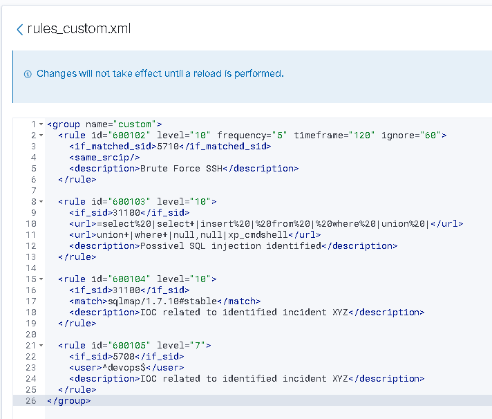

# Wazuh - Laboratório de Regras Customizadas

**Data:** 13/03/2026  
**Autor:** Flávio  
**Objetivo:** Testar criação de regras customizadas no Wazuh para detecção de ataques e IOCs.

---

## 🔹 O que foi feito

Durante o laboratório, criei 4 regras customizadas no Wazuh:
- **600102** - Força bruta SSH (baseada na regra 5710)
- **600103** - SQL Injection em logs web
- **600104** - IOC do User-Agent do sqlmap
- **600105** - IOC do usuário devops

Todas as regras foram adicionadas no arquivo `rules_custom.xml`:



---

## 🔹 Regras e Alertas

### 1. Força Bruta SSH (600102)
```xml
<rule id="600102" level="10" frequency="5" timeframe="120" ignore="60">
  <if_matched_sid>5710</if_matched_sid>
  <same_srcip/>
  <description>Brute Force SSH</description>
</rule>
https://assets/wazuh-rule-brute-force-ssh.jpg

Alerta disparado:
https://assets/wazuh-alerta-600102-disparado.jpg

2. SQL Injection (600103)
xml
<rule id="600103" level="10">
  <if_sid>31100</if_sid>
  <url>=select%20|select+|insert%20|%20from%20|%20where%20|union%20|</url>
  <url>union+|where+|null,null|xp_cmdshell</url>
  <description>Possivel SQL injection identified</description>
</rule>
Alerta disparado:
https://assets/wazuh-alerta-600103-sql-injection.jpg

3. IOC sqlmap (600104)
xml
<rule id="600104" level="10">
  <if_sid>31100</if_sid>
  <match>sqlmap/1.7.10#stable</match>
  <description>IOC Detectado - UserAgent - Incidente XPT</description>
</rule>
Alerta disparado:
https://assets/wazuh-alerta-600104-ioc-sqlmap.jpg

4. IOC devops (600105)
xml
<rule id="600105" level="7">
  <if_sid>5700,5710,5715,5716,5763</if_sid>
  <user>devops</user>
  <description>IOC Detectado - User devops - Incidente XPT</description>
</rule>
Alerta disparado:
https://assets/wazuh-alerta-600105-ioc-devops.jpg

✅ Resumo
Regra	Descrição	Level	Funcionou?
600102	Força Bruta SSH	10	✅
600103	SQL Injection	10	✅
600104	IOC sqlmap	10	✅
600105	IOC devops	7	✅
Total de prints: 8

📂 Anexos
Todos os prints estão na pasta assets/.